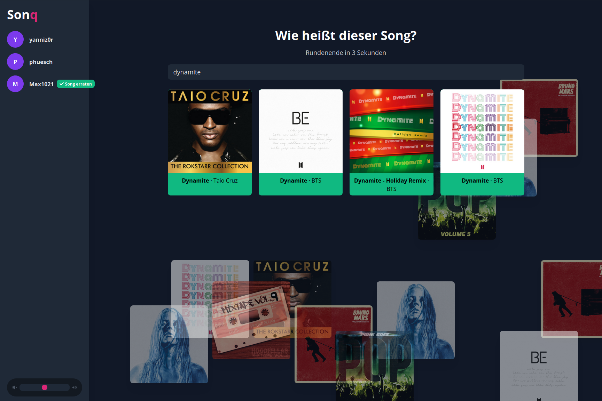
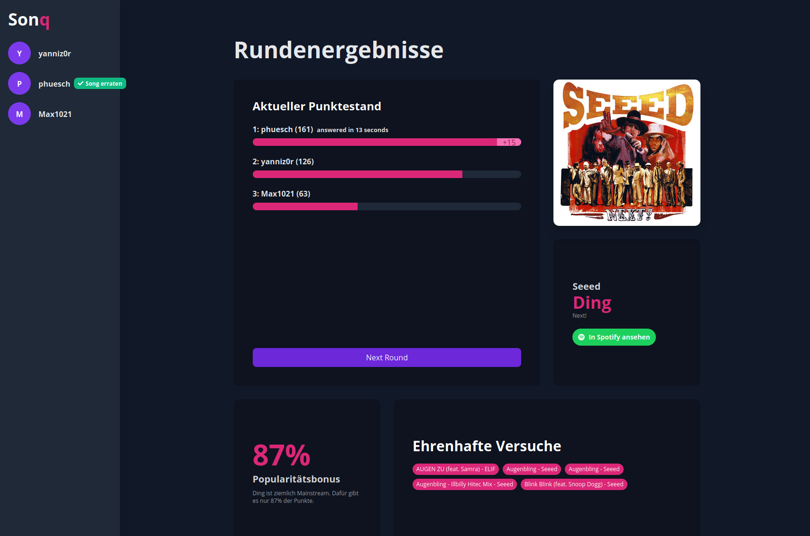

# Sonq

> An interactive song guessing game, hostend in the interwebz

Sonq is a web based online multiplayer game which allows you to guess songs based on the spotify 30 second preview. When you guess a song correctly, you get points based on the time it took you and the popularity of the song.

## Configuration

Server and client need a configuration to run. Please make sure to supply each application with the required values.

You need a spotify client for each application. You can get credentials [here](https://developer.spotify.com/dashboard/login).

### Server

Configuration is handled via `dotenv`. Therefore, you can create a `.env` file in the `packages/server` directory and it will automagically load your configuration into the environment. Alternatively, you can specify each value by hand in the command line.

The following configuration parameters are available:

- `SPOTIFY_CLIENT_SECRET`: The secret for your spotify client
- `SPOTIFY_CLIENT_ID`: The ID for the spotify client you want to use
- `SPOTIFY_REDIRECT_URI`: The url where the frontend redirects you after authentication with spotify to. Usually, it should be something like `https://sonq.de/spotify-redirect`.

### Client

The client does not do much. It only needs to know where itself lives, where the backend lives and which spotify client id it shold use to create the authentication link.

- `SPOTIFY_CLIENT_ID`: Same as for the server
- `SERVER_URL`: The base url for the server application. Defaults to http://localhost:4000 for development
- `CLIENT_URL`: The base url for the client application. Defaults to http://localhost:3000 for development

## Development Setup

- clone this repository
- run `yarn` in the root of the project
- make sure you provide a configuration (see above)
- run `yarn dev`

## Production Setup

This applies for the server and the client.

- Go into the directory of the application you want to start
- `yarn`
- `yarn workspace @sonq/api run build`
- `yarn build`
- `yarn start`

## Props

This game has been developed live on twitch [by me](https://www.twitch.tv/yanniz0r) and my viewers. Thanks for the great support, issues and input. This would not have been possible without you 
❤️.